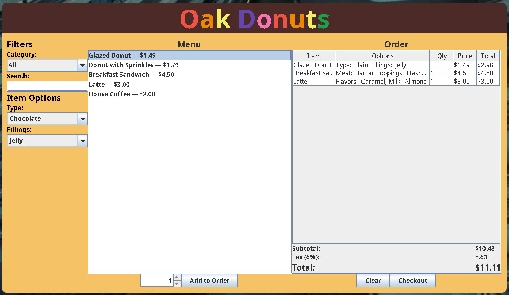
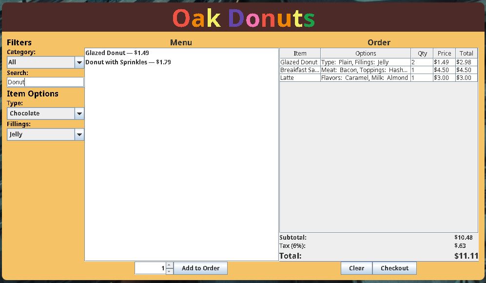
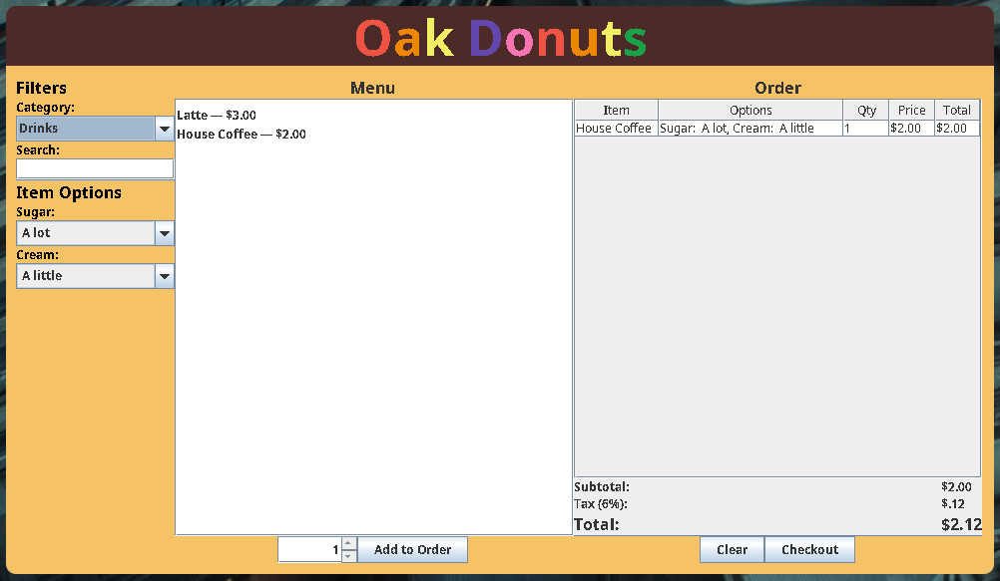

# Oak Donuts
This is a project developed for CMPSC 221.
The code is based on Gokhan's Hot Dog Stand GUI and the appearance is based off of Professor Oakes's GUI mockup.
It utilizes Java Swing to create a user friendly and intuitive user interface. 
This project also uses a derby database to perform all of the CRUD operations.

## Images

